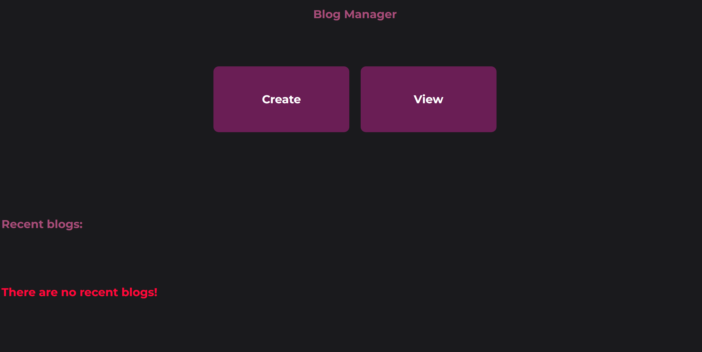
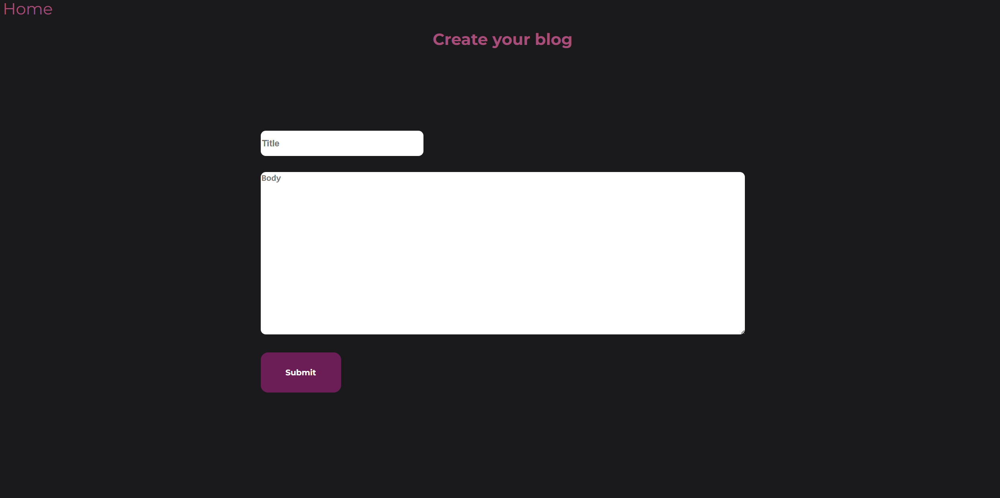
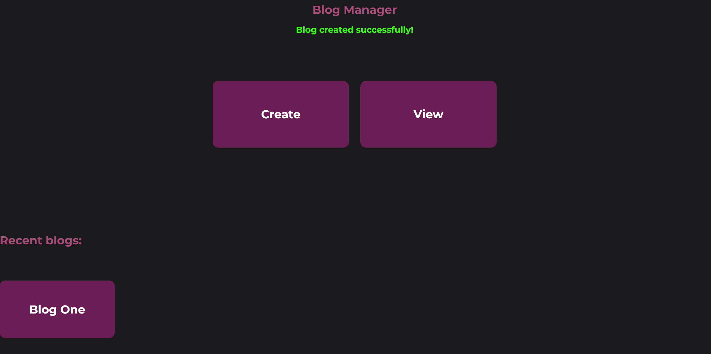
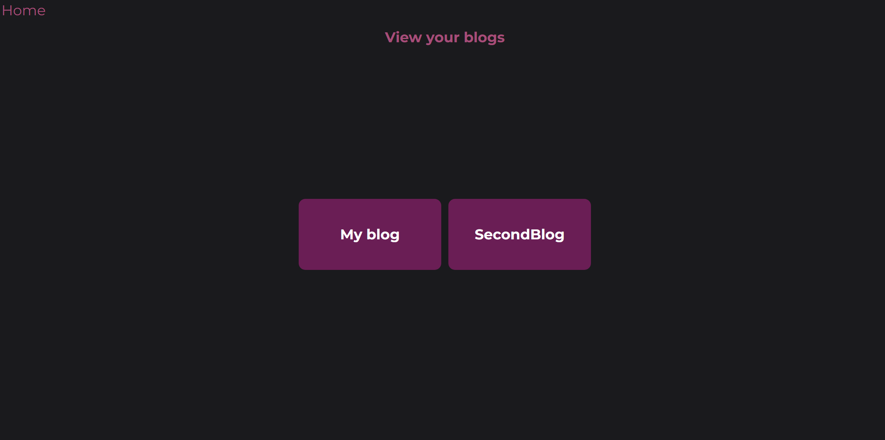
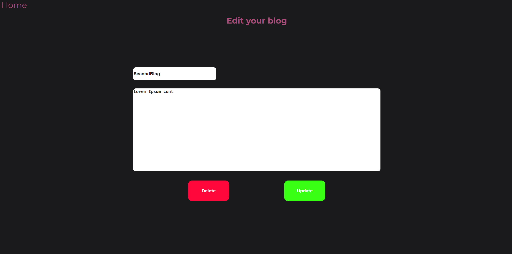

# Blog-Web-App
This blog web application is built using Express.js, providing a lightweight and efficient way to manage blog posts. It follows RESTful principles by allowing users to create, read, update, and delete (CRUD) blog entries using HTTP Methods.

## Website preview (Downloads a small video on your device):

## Features:

### UI/UX:
A comfortable UX with a relaxing and simple UI to simplify user interactions.

### Create blog:
Users can create a blog by providing a title and body for their post. If they change their mind, they can easily navigate back to the homepage without saving any data.

After creating a blog a flash message appears with the status of your blog creation request, as well as your blog now appearing in the recent blogs section.

### View created blogs:
Users can view all the blogs they've created, with the option to edit or delete individual posts. This makes it easy to manage and update content.

### Update created blogs:
Users can edit any blog they've created by selecting it from the view menu. This allows them to make changes to the title or body of the post as needed.

After updating, they will be greeted with a flash message confirming whether the changes were successfully made or notifying them that no changes were made if the information remained the same.

Successful update operation:

