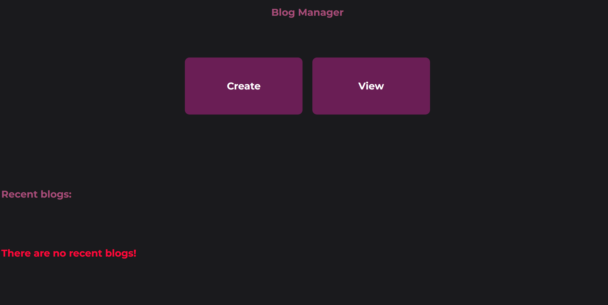
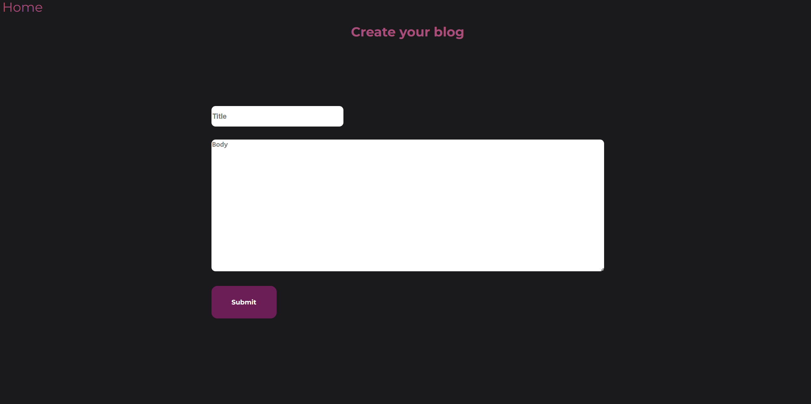
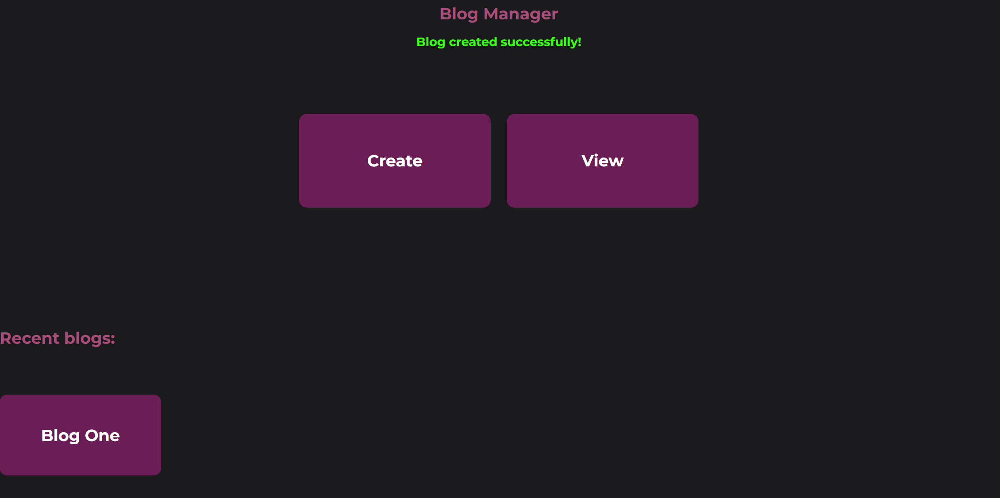
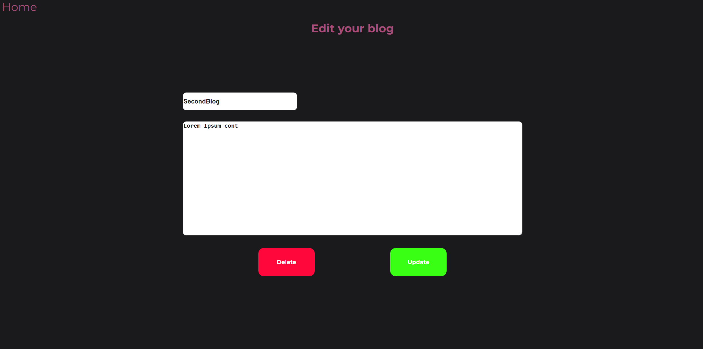
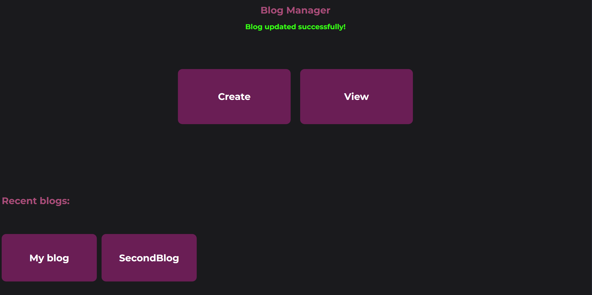

# Blog-Web-App
This Blog Web Application is a simple, efficient, and user-friendly platform built using Express.js. It leverages RESTful principles to provide a seamless experience for users to manage their blog posts. The app enables users to create, read, update, and delete blog entries, with a clean and intuitive interface that enhances usability. The application is designed with a comfortable UI/UX to ensure effortless interaction and quick access to key functionalities.

Tech stack:
- NodeJS
- ExpressJS
- EJS
- HTML
- CSS

How to install:
1. Clone/Fork the repository.
2. Download the latest version of NodeJS.
3. Open the terminal in your editor (CTRL + `) in VSCode.
4. Run `npm install` to install all dependencies.
5. Run `node index.js` or `nodemon index.js` Depending on what you use.
6. Navigate to `localhost:3000` on your browser.

## Website preview (Downloads a small video on your device):

## Features:

### UI/UX:
A comfortable UX with a relaxing and simple UI to simplify user interactions.

### Create blog:
Users can create a blog by providing a title and body for their post. If they change their mind, they can easily navigate back to the homepage without saving any data.

After creating a blog a flash message appears with the status of your blog creation request, as well as your blog now appearing in the recent blogs section.

### View created blogs:
Users can view all the blogs they've created, with the option to edit or delete individual posts. This makes it easy to manage and update content.

### Update created blogs:
Users can edit any blog they've created by selecting it from the view menu or from the recent blogs section in the home page. This allows them to make changes to the title or body of the post as needed.

After updating, they will be greeted with a flash message confirming whether the changes were successfully made or notifying them that no changes were made if the information remained the same.

Successful update operation:

No changes made:

### Delete created blogs:
Users can delete any blog they've created by selecting it from the view menu or from the recent blogs section in the home page.

Upon successful deletion of a blog, it will disappear from the view page and the recent blog section, as well as a flash message appearing to confirm the action was done successfully

